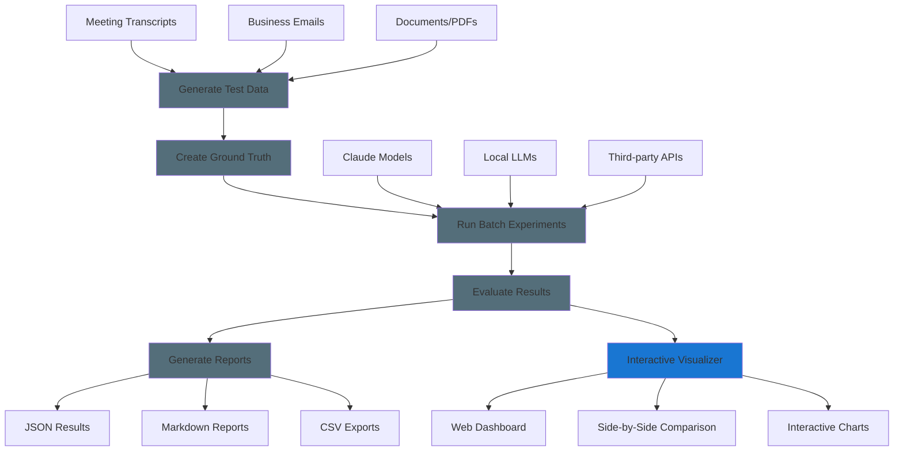

# GAIA Evaluation Framework

## Overview

The GAIA evaluation framework provides systematic tools for testing and comparing AI model performance across different deployment scenarios. This framework enables generation of synthetic test data, creation of evaluation standards, and automated performance comparison.

### Quick Example: Email Summarization

Here's what happens when you evaluate email summarization:

1. **Generate Test Data** → Creates `customer_support_email.txt` with realistic email content
   - *Why needed:* Real emails contain sensitive data; synthetic data provides realistic scenarios without privacy concerns

2. **Create Ground Truth** → Produces `customer_support_email.summarization.groundtruth.json` with expected summary
   - *Why needed:* Models need objective standards to measure against; human experts define what "good" looks like

3. **Run Experiments** → Generates `Claude-Email-Summary.experiment.json` with model responses  
   - *Why needed:* Captures actual model outputs under controlled conditions for repeatable testing

4. **Evaluate Results** → Creates `Claude-Email-Summary.experiment.eval.json` with scored comparisons
   - *Why needed:* Converts subjective quality into measurable metrics (accuracy, completeness, relevance)

5. **Generate Reports** → Outputs `email_evaluation_report.md` with human-readable analysis
   - *Why needed:* Raw scores don't tell the story; reports reveal patterns, strengths, and improvement areas

Each step builds on the previous, creating a complete evaluation pipeline from raw data to actionable insights.

## System Architecture



## Installation

```bash
# Install evaluation capabilities
pip install .[eval]

# Set up Claude API for synthetic data generation
export ANTHROPIC_API_KEY=your_key_here

# Optional: Start Lemonade for local LLM processing if not running
lemonade-server serve
```

## Command Reference

### Synthetic Data Generation

Generate realistic test scenarios for evaluation purposes.

#### Meeting Transcripts

```bash
# Generate meeting transcripts with full options
gaia generate --meeting-transcript -o ./test_data/meetings --meeting-types standup planning design_review --count-per-type 1 --target-tokens 1000
```

**Available meeting types:**
- `standup` - Daily standup meetings
- `planning` - Sprint/project planning sessions
- `client_call` - Client communication meetings
- `design_review` - Technical design reviews
- `performance_review` - Employee performance discussions
- `all_hands` - Company-wide meetings
- `budget_planning` - Financial planning sessions
- `product_roadmap` - Product strategy meetings

#### Business Emails

```bash
# Generate business emails with full options
gaia generate --email -o ./test_data/emails --email-types project_update meeting_request customer_support --count-per-type 1 --target-tokens 1000
```

**Available email types:**
- `project_update` - Project status communications
- `meeting_request` - Meeting scheduling emails
- `customer_support` - Customer service interactions
- `sales_outreach` - Sales and marketing communications
- `internal_announcement` - Company announcements
- `technical_discussion` - Technical team communications
- `vendor_communication` - External vendor interactions
- `performance_feedback` - Performance review communications

### Ground Truth Creation

Transform synthetic data into evaluation standards.

```bash
# Create evaluation standards with all options
gaia groundtruth -d ./test_data -p "*.txt" --use-case summarization -o ./groundtruth
gaia groundtruth -d ./test_data -p "*.pdf" --use-case qa -o ./groundtruth
gaia groundtruth -d ./test_data -p "*.txt" --use-case email -o ./groundtruth
```

**Use case options:**
- `qa` - Question-answer pair generation
- `summarization` - Summary generation tasks
- `email` - Email processing tasks

### Batch Experimentation

Run systematic model comparisons.

```bash
# Create and run batch experiments, can also use your own config, see ./src/gaia/eval/configs for examples.
gaia batch-experiment --create-sample-config experiment_config.json
gaia batch-experiment -c experiment_config.json -i ./groundtruth/consolidated_summarization_groundtruth.json -o ./experiments
```

**Sample configuration structure:**
```json
{
  "experiments": [
    {
      "name": "Claude Baseline",
      "model": "claude-3-sonnet-20240229",
      "provider": "anthropic"
    },
    {
      "name": "Local Llama",
      "model": "llama-3.2-3b",
      "provider": "lemonade"
    }
  ]
}
```

### Third-Party LLM Templates

Create standardized templates for external model evaluation.

```bash
# Generate templates for manual testing
gaia create-template -d ./test_data --use-case summarization --format json -o ./templates/
gaia create-template -d ./test_data --use-case qa --format csv -o ./templates/
```

**Supported formats:** json, csv, jsonl, xml

### Evaluation and Reporting

Analyze experiment results and generate reports.

```bash
# Evaluate results and generate reports
gaia eval -d ./experiments -o ./evaluation
gaia report -d ./evaluation -o ./reports/report.md

# Launch interactive web visualizer for comparing results
gaia visualize --experiments-dir ./results --evaluations-dir ./evaluation
```

#### Evaluation Options

The `gaia eval` command supports two input modes:

**Single File Mode (`-f`):**
```bash
# Evaluate a single experiment file
gaia eval -f ./experiments/Claude-Sonnet-Basic-Summary.experiment.json -o ./evaluation
```

**Directory Mode (`-d`):**
```bash
# Evaluate all JSON files in a directory 
gaia eval -d ./experiments -o ./evaluation
```

The directory mode will automatically find and process all `.json` files in the specified directory, providing individual evaluation results for each file plus consolidated usage and cost information.

## Evaluation Workflows

### Meeting Transcripts Summarization

```bash
# 1. Generate test data (see Command Reference for full options)
gaia generate --meeting-transcript -o ./test_data/meetings --meeting-types standup planning --count-per-type 2

# 2. Create evaluation standards
gaia groundtruth -d ./test_data/meetings --use-case summarization -o ./groundtruth

# 3. Run batch experiment
gaia batch-experiment -c ./src/gaia/eval/configs/basic_summarization.json -i ./test_data/meetings -o ./experiments

# 4. Evaluate and report
gaia eval -d ./experiments -o ./evaluation
gaia report -d ./evaluation -o ./reports/meeting_summarization_report.md

# 5. Launch interactive visualizer
gaia visualize --experiments-dir ./experiments --evaluations-dir ./evaluation
```

### Email Summarization

```bash
# 1. Generate email test data
gaia generate --email -o ./test_data/emails --email-types customer_support project_update --count-per-type 3

# 2-4. Follow same groundtruth → batch-experiment → eval → report pattern as above
```

### Document Q&A

```bash
# 1. Prepare document data
mkdir -p ./test_data/documents
cp ./data/pdf/Oil-and-Gas-Activity-Operations-Manual-1-10.pdf ./test_data/documents/

# 2-4. Follow same groundtruth → batch-experiment → eval → report pattern with --use-case qa
```

### Third-Party LLM Evaluation

For testing external models (OpenAI, etc.) that can't be integrated directly:

```bash
# 1. Generate test data and standards
gaia generate --meeting-transcript -o ./test_data/meetings --meeting-types standup --count-per-type 2
gaia groundtruth -d ./test_data/meetings --use-case summarization -o ./groundtruth

# 2. Create template for manual testing
gaia create-template -f ./groundtruth/*.json -o ./templates/

# 3. Manual step: Fill template with third-party LLM responses
# Edit ./templates/*.template.json - paste responses into "response" fields

# 4. Evaluate completed template
gaia eval -d ./templates -o ./evaluation
gaia report -d ./evaluation -o Third_Party_Report.md
```

**Template structure for manual testing:**
```json
{
  "test_id": "meeting_001",
  "input_text": "Full meeting transcript...",
  "ground_truth": "Expected summary...",
  "response": "", // <- Paste third-party LLM response here
  "evaluation_criteria": {...}
}
```

## Interactive Results Visualizer

The evaluation framework includes a web-based visualizer for interactive comparison of experiment results.

### Overview

The visualizer provides a user-friendly interface to:
- **Compare Multiple Experiments**: Side-by-side comparison of different model configurations
- **Analyze Key Metrics**: Cost breakdowns, token usage, and quality scores
- **Inspect Quality Ratings**: Detailed analysis of evaluation criteria performance
- **Track Performance Trends**: Visual indicators for model improvement areas

### Launch the Visualizer

```bash
# Launch with default settings (looks for ./experiments, ./evaluation, ./test_data, and ./groundtruth directories)
gaia visualize

# Specify custom data directories
gaia visualize --experiments-dir ./my_results --evaluations-dir ./my_evaluations --test-data-dir ./my_test_data --groundtruth-dir ./my_groundtruth

# Launch on different port or host
gaia visualize --port 8080 --host 0.0.0.0 --no-browser
```

### Visualizer Features

**Data Loading:**
- Automatically discovers `.experiment.json` files in the experiments directory
- Loads corresponding `.experiment.eval.json` files from the evaluations directory
- Displays test data files (emails, meeting transcripts) with generation metadata and costs
- Shows groundtruth files with evaluation criteria, expected summaries, and generation details
- Real-time file system monitoring for new results

**Comparison Interface:**
- Grid layout for side-by-side experiment comparison
- Expandable sections for detailed metrics review
- Color-coded quality indicators (Excellent/Good/Fair/Poor)

**Performance Analytics:**
- Cost analysis with input/output token breakdown
- Quality score distributions and averages
- Model configuration comparison (temperature, max tokens, etc.)
- Experiment metadata and error tracking

### Integrated Workflow

The visualizer integrates seamlessly with the evaluation pipeline:

```bash
# 1. Generate test data
gaia generate --meeting-transcript -o ./test_data --count-per-type 2

# 2. Create evaluation standards  
gaia groundtruth -d ./test_data --use-case summarization -o ./groundtruth

# 3. Run batch experiments
gaia batch-experiment -c config.json -i ./test_data -o ./experiments

# 4. Evaluate results
gaia eval -d ./experiments -o ./evaluation

# 5. Launch visualizer for interactive analysis (includes test data and groundtruth)
gaia visualize --experiments-dir ./experiments --evaluations-dir ./evaluation --test-data-dir ./test_data --groundtruth-dir ./groundtruth

# 6. Generate static reports for documentation
gaia report -d ./evaluation -o ./reports/comparison_report.md
```

### System Requirements

- **Node.js**: Required for running the web server (auto-installs dependencies)
- **Modern Browser**: Chrome, Firefox, Safari, or Edge with JavaScript enabled
- **File System Access**: Read permissions for experiment and evaluation directories

## Configuration Options

### Model Providers

- **anthropic** - Claude models via Anthropic API
- **lemonade** - Local models via Lemonade server

### Evaluation Metrics

The framework evaluates responses across multiple dimensions:

- **Correctness** - Factual accuracy relative to source content
- **Completeness** - Comprehensive coverage of key information
- **Conciseness** - Appropriate brevity while maintaining accuracy
- **Relevance** - Direct alignment with query requirements

### Output Formats

Results are generated in multiple formats:
- JSON files for programmatic analysis
- Markdown reports for human review
- CSV exports for spreadsheet analysis

## Troubleshooting

### Common Issues

**API Key Issues:**
```bash
# Verify API key is set
echo $ANTHROPIC_API_KEY

# Test API connectivity
gaia generate --meeting-transcript -o ./test --count-per-type 1
```

**Lemonade Server Connection:**
```bash
# Check if server is running
curl http://localhost:8000/api/v1/health

# Start server if needed
lemonade-server serve
```

**File Path Issues:**
- Use absolute paths when relative paths fail
- Ensure output directories exist or can be created
- Check file permissions for read/write access

### Performance Tips

- Start with small datasets to validate configuration
- Use `--count-per-type 1` for initial testing
- Monitor token usage and API costs during generation
- Parallelize experiments when testing multiple models

## Examples

See the [evaluation examples](../test_data/) directory for sample configurations and test data.